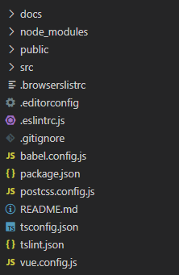
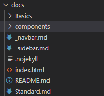
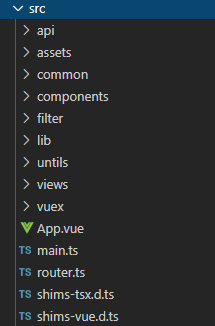
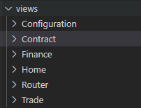

#### 以下就是项目介绍( 只讲主要的细微致自己再看 )
##### 项目根目录

###### 1. docs( 技术文档 )

> Standard( 规范 ),  Basics: 基础目录,  components: 组件目录,  _navbar( 右上角头部 ),  _sidebar( 左侧菜单 ),   .nojekyll( 解决无法识别 ' _ ' 的问题 ),  index.html 主入口文件,  框架配置也在index里,    README( 首页( 相当于'/' ) )
###### 2. node_modules
>   项目所需依赖
###### 3. public
>   项目的入口目录
###### 4. src
>   项目的开发主目录 往下翻会详解这个目录 [跳到详解](#src延伸)
###### 5. babel.config.js
>   项目的Ui库按需引入的配置
###### 6. package.json
>   项目的所有依赖版本号,  有生产环境与开发环境
###### 7. postcss.config
>   可配置一些size变量的构建
###### 8. README.md
>   项目的说明
##### 9. tslint
>   校验规则的配置
##### 10. vue.config
>   项目主要配置文件, 跨域,  路径别名,  打包别名, 依赖的忽略等
##### src延伸

##### 1. api
>   前后端请求的axios的二次封装,  项目所有请求都在`api/index.ts`文件,  请求封装的方法在`api/axios.ts`
##### 2. assets
>   公用的静态资源,  全局css, font, img, ts, prototype
##### 3. common
>   公用的组件,  高级搜索, 表格, 弹出框, 分页,  正则匹配等( 具体在左侧菜单组件都可查看 )
##### 4. components
>   静态组件, 左侧菜单, 合同, 公参, 项目结构( index.vue )
##### 5. filter
>   `fillter/index.ts`过滤文件, 例如常用的1转Yes, 0转No, 具体可查看文件都有对应注释
##### 6. lib
>   `lib/echarts.js` 可视化的按需引入
##### 7. untils
>   `untils/router.ts`路由模块的静态资源
##### 8. views 
  所有模块页面 
 
>   Configuration : 公参, Contract : 合同, Finance : 财务, Home : 首页, Router : 路由, Trade : 交易
##### 9. vuex
>   状态管理
##### 10. App.vue
>   .vue主文件
##### 11. main.ts
>   所有公有注册都在此文件, ts的入口文件
##### 12. router
>   路由, 这个项目没有权限之分, 所以这里就是所有页面的路径引入
##### 13. router-menu
>   左侧菜单需要增加模块或者子模块都在 `src/components/menu/router-menu.ts` 配置
##### 14. menu-icon
>   左侧菜单需要增加模块icon或者子模块icon都在`src/components/menu/icon.url` 配置