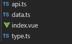

##### 规范分为四大块 : [template](#template) | [style](#style) | [typescript](#typescript) |  [Vue](#Vue注意事项)  | [目录的构建](#目录的构建)

### template
+ 多使用语义化的标签, 如```header,nav,section```, 段落使用```section```, 头部使用```header```, tab使用```nav```等, 有助于机器（搜索引擎）理解，另一方面多人协作时，能迅速了解开发者意图。<br>
+ 必须有根元素 如  `<template><div> 内容... </div></template>`<br>
+ 标签必须有效闭合 不能 `<template><div> 内容... <div></template>`<br>
+ 尽量减少标签数量 如果很多的话使用组件化分离出来<br>
+ 自闭合（self-closing）标签，无需闭合 ( 例如： img input br hr 等 )；<br>
+ 可选的闭合标签（closing tag），需闭合 ( 例如：`</li>` 或 `</body>` )；
``` html

<input type="text" name="title">
<ul>
  <li>Style</li>
  <li>Guide</li>
</ul>
<!-- 不推荐 -->
<span class="avatar">
  
</span>
<!-- 推荐 -->

```
 **Class 与 ID**
+ class 应以功能或内容命名，不以表现形式命名；
+ class 与 id 单词字母小写，多个单词组成时，采用中划线-分隔；
+ 使用唯一的 id 作为 javascript hook, 同时避免创建无样式信息的 class；
``` html
<!-- 不推荐 -->
<div class="j-hook left contentWrapper"></div>
<!-- 推荐 -->
<div id="j-hook" class="sidebar content-wrapper"></div>
```
### 属性顺序
HTML 属性应该按照特定的顺序出现以保证易读性。<br>
+ id <br>
+ class
+ name
+ data-xxx
+ src, for, type, href
+ title, alt
+ aria-xxx, role
``` html
<a id="..." class="..." data-modal="toggle" href="###"></a>
<input class="form-control" type="text">

```
### 引号
属性的定义，统一使用双引号。
``` html
<!-- 不推荐 -->
<span id='j-hook' class=text>Google</span>
<!-- 推荐 -->
<span id="j-hook" class="text">Google</span>
```
### style
+ 必须加上 `scoped`, 防止其他页面相同`class|id`造成样式混乱的问题
+  代码组织 <br>
注释规范:`组件块`和`子组件`块以及声明块之间使用一空行分隔，`子组件块`之间三空行分隔
+  Class 和 ID<br>
+ 使用语义化、通用的命名方式；<br>
+ 使用连字符 - 作为 ID、Class 名称界定符，不要驼峰命名法和下划线；<br>
+ 避免选择器嵌套层级过多，尽量少于 3 级；<br>
+ 避免选择器和 Class、ID 叠加使用；<br>
+ 出于`性能考量`，在没有必要的情况下避免元素选择器叠加 Class、ID 使用。<br>
+ 元素选择器和 ID、Class 混合使用也违反关注分离原则。如果HTML标签修改了，就要再去修改 CSS 代码，不利于后期维护。
4. 引号使用<br>
`url()` 、属性选择符、属性值使用双引号
5. 声明块格式<br>
+ 选择器分组时，保持独立的选择器占用一行；<br>
+ 声明块的左括号 `{` 前添加一个空格；<br>
+ 声明块的右括号` }` 应单独成行；<br>
+ 声明语句中的 `:` 后应添加一个空格；<br>
+ 声明语句应以分号 `;` 结尾；
+ 一般以逗号分隔的属性值，每个逗号后应添加一个空格；<br>
+ `rgb()`、`rgba()`、`hsl()`、`hsla()` 或 `rect()` 括号内的值，逗号分隔，但逗号后不添加一个空格；<br>
+ 对于属性值或颜色参数，省略小于 1 的小数前面的 0 （例如，`.5` 代替 `0.5`；`-.5px` 代替`-0.5px`）；<br>
+ 十六进制值应该全部小写和尽量简写，例如，`#fff` 代替 `#ffffff`；<br>
+ 避免为 0 值指定单位，例如，用 `margin: 0`; 代替 `margin: 0px;`；


### typescript
1. 变量的声明<br>
+   拒绝使用`var`使用`let`代替,因为`var`存在变量提升<br>
    `let loadingModules = {};`
+  `const`只声明静态基础类型的数据,尽量不要声明引用类型, `const`声明的变量一律大写, 变量使用`Camel`命名<br>
+ 私有属性、变量和方法以下划线 `_` 开头<br>
`let _privateMethod = {};`
+ 函数, 使用` Camel` 命名, 函数的参数, 使用 `Camel` 命名, 所接受的参都必须声明类型<br>
+  类, 使用 `Pascal` 命名法
``` javascript
function TextNode(value:string, engine:number) {
    this.value = value;
    this.engine = engine;
}
TextNode.prototype.clone = function () {
    return this;
};
```
+ 枚举变量 使用 Pascal 命名法。<br>
+  枚举的属性， 使用全部字母大写，单词间下划线分隔的命名方式。
``` javascript
let TargetState:{[k:string]:number} = {
    READING: 1,
    READED: 2,
    APPLIED: 3,
    READY: 4
};
```
2. 命名语法 <br>
+ 类名，使用名词。
``` javascript
function Engine(options:object) {}
```
+ 函数名，使用动宾短语。
``` javascript
function getStyle(element:object) {}
```
+ boolean 类型的变量使用 is 或 has 开头。
``` javascript
let isReady:boolean = false;
let hasMoreCommands:boolean = false;
```
+ Promise 对象用动宾短语的进行时表达。
``` javascript
let loadingData:Function = ajax.get('url');
loadingData.then(callback);
```

#### Vue注意事项
1. 组件加载方式
不要直接使用import注册组件并且使用
``` javascript
// 避免
import Table from '@/views/Finance/components/Advancedsearch/index.vue'
@Component({
  components: {
    Table,
  }
})
// 正确应用
@Component({
  components: {
    Table: ()=> ('@/views/Finance/components/Advancedsearch/index.vue')
  }
})
```
2. keep-alive<br>
+ `执行的生命周期: created -> mounted -> activated -> deactivated` `created` and `mounted` 只会执行一次,第二次执行只有 
`activated` 启用缓存, `deactivated` 停用缓存 , 如果是一个处于长期缓存状态的组件,网络请求写在`activated`, 避免`created`只执行一次而造成数据不同步更新问题
+ 使用了动态组件, 必须加上key, 如果不加的话, 比如说`a,b`,结构一致, 那么key(也就是下标相同了,比如初始时`0`的话,俩个都是0就重复了, 就会导致页面不重置,访问的还是第一次访问的页面)
``` html
  <keep-alive>
    <div :is="Component" :key="key" />
  </keep-alive>
```
3. 修改源数据的问题
``` javascript
import options from './data'
import { deepClone } from '@/assets/ts/index'
    // 默认数据
    // options = [
    //     {
    //         name:'dyh'
    //     }
    // ]
    methods:{
        editOption(){
            options[0]['value'] = '新增的value属性';
        }
    }
    /* options = [{name:'dyh',value:'新增的value属性'}]
       新增都没有什么问题对吧, 当我们离开页面后再回来这个页面, 正常是不是这个options = [{name:'dyh'}]
       其实不是的, options = [{name:'dyh',value:'新增的value属性'}]
       因为修改了文件内的变量, 具有缓存所以vue重新获取的还是上一次更改的数据
       先深拷贝再使用 let newOptions = deepClone(options);
       对 newOptions 做对应操作
    */
```
### 目录的构建
<br>
+ api : 接口的请求<br>
+ data : 高级搜索, 表格等其他静态数据<br>
+ index : 主文件<br>
+ type : 主文件所有函数, 方法, 变量的声明