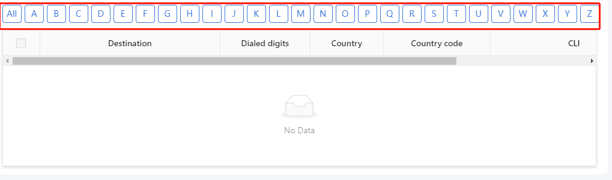
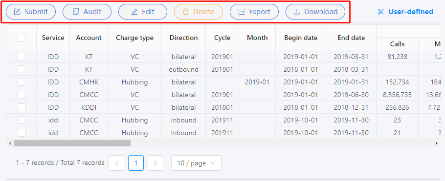

# table组件
> 表格组件
> 组件所在位置  `vue-ts-admin\src\views\Finance\components\Table`

## 简单使用
> 使用前先学习[antd table组件](https://www.antdv.com/components/table-cn/)
```html
<Table
    :columns="columns"
    :data="data"
/>
```

```javascript
<script lang="ts">
import Vue from "vue";
import { Component } from "vue-property-decorator";
@Component({
  components: {
    Table: () => import("@/views/Finance/components/Table/index.vue"),
  }
})
export default class XXX extends Vue {
    // 此处省略类型申明 书写代码时 记得写上
    private columns = [{
            title: 'Service',
            dataIndex: 'serviceName',
            key: 'serviceName',
        },
        {
            title: 'Account',
            dataIndex: 'accountName',
            key: 'accountName',
    }]
    private data = [{
           serviceName:'11',
           accountName:'11x'
        },
        {
           serviceName:'22',
           accountName:'22x'
    }]
}

</script>
```
> ## Props
> *代表官方api,请先看官方文档

| prop                             | 简介                 |  类型      | 默认值 |  必传 |
| :---------------------           | :-----               | :------   | :----: | :--: |
| [isAlphabet](#isalphabet)        | 字母表显示            | Boolean   |   否   |  否   |
| columns*                         | 表头                 |   Array   |   --    |  是  |
| data*                            | 数据                 |   Array   |   --    |  是  |
| childColumnss                    | 展开项表头(同columns) |   Array   |   --    |  否  |
| childData                        | 展开项数据(同data)    |  Array    |   --    |  否  |
| expandRow                        | 启用展开行            |  Boolean  |   否    |  否  |
| childTab                         | 展开内容嵌套表格       | Boolean   |   否   |  否  |
| zebraStripe*                     | 启用斑马纹            |  Boolean  |   否    |  否  |
| lessSpace                        | 表格内容小padding样式  | Boolean   |   否   |  否  |
| rowClassName*                    | 修改行属性(增加class)       |Function(record,index):string      |  --   |   否   |
| customCell*                      | 修改列属性(增加class)       |Function(record,index):string      |  --   |   否   |
| parentKey(即rowKey*)             | 设置唯一值(rowKey)          |string&#124;Function(record):string |  --   |   否   |
| childKey(即rowKey*)              | 设置唯一值(展开表格的rowKey) |string&#124;Function(record):string |  --   |   否   |
| childDataKey(即data*)            | 展开表格种指定使用data的哪个key,作为数据(即childDataKey="aa" 则展开table的data属性传入data['aa'] )|string&#124;Function(record):string|   --    |   否   |
| [isShowDownloadColor](#isShowDownloadColor)| [点击查看](#isShowDownloadColor)                    |  Boolean           |  否  |  否  |
| singlePageTableClass                       | 在官方table增加父级class                            |  Array < string >  |  --  |  否  |
| expandRow                                  | 是否支持点击展开                                    |  Boolean           |  否  |  否  |
| isTableHeight                              | 是否不需要通过计算从而设置scroll.y,否为不设置scroll.y |  Boolean           |  否  |  否  |
| backPagination                             | 是否启用后台分页(需后台配合)                         |  Boolean           |  否  |  否  |
| [backPaginationObj](#backPaginationObj)    | 后台分页配置                                        |  Object            |  --  |  否  |
| border(bordered*)                          | 是否启用边框                                        |  Boolean           |  否  |  否  |
| showHeader*                                | 是否显示表头                                        |  Boolean           |  是  |  否  |
| scrollX(scroll*)                           | 使用官方:scroll = { x: scrollX }                    |  String&#124;Number|  否  |  否  |
| isNeedCheck                                | 表格是否需要 选择框                                  |  Boolean           |  否  |  否  |
| isSingleCheck                              | 选择框是否为单选                                     |  Boolean           |  否  |  否  |
| [selectedBtn](#selectedBtn)                | 表格上方按钮                                        |  Array < Object >   |  --  |  否  |
| useDefined                                 | 是否使用useDefined (用户自定义展示项)                |  Boolean            |  是  |  否  |
| useSelectedRowKeys(该属性可以修改为非prop，主要为防止出现问题)|官方rowSelection prop 是否增加传入selectedRowKeys的key，用于记录勾选行实现清空勾选行|    Boolean     |  是  |  否  |
| isPagination                               | 是否使用table的分页                                  |  Boolean            |  是  |  否  |

其它props查看[antd table组件](https://www.antdv.com/components/table-cn/)
### isAlphabet
> - 描述：字母表显示
> - 默认：否

效果


源码位置
```html
<!-- 字母表 -->
...
<div class="alphabetList" v-if="isAlphabet">
    <a-button
    class="resetBtn"
    v-for="(item, index) in alphabet"
    :class="{isActive: isActive === index} "
    :key="index"
    @click="toggleLetter(item,index)"
    >{{item}}</a-button>
</div>
...
```

### isShowDownloadColor
使用这个时
```javascript
  scopedSlots: { 
    customRender: "download"
  }
```
是否显示为超链接样式

```javascript

// columns
[{
  title: 'xx22',
  dataIndex: 'xx',
  key: 'xx',
  scopedSlots: { // 使用这个时
    customRender: "download"
  }
}]
```

### backPaginationObj
> 后台分页配置
> 类型和默认值
```javascript
@Prop({
    type: Object,
    default: () => {
      return {
        pageSizeOptions: ["10", "20", "50", "100"], //  表格分页每页显示的条数
        defaultPageSize: 10, //  表格分页每页条数
        defaultCurrent: 1, // 表格分页当前页
        size: "", // 尺寸分页
        hideOnSinglePage: false, // 只有一页时是否隐藏分页器
        showQuickJumper: false, // 是否可以快速跳转至某页
        current: 1,
        pageSize: 10,
        align: "left",
        total: 0
      };
    }
  })  private backPaginationObj?: any; // 后台分页配置
```

### selectedBtn
> 表格上方的按钮
```javascript
[
  {
    name: "Add",  // 按钮显示的名字
    icon: "plus-circle",  // 按钮的图标
    index: 1 // 可以是 number或者是string
    disabled: true, // 按钮是否禁止
    tips: 'Please select only one record' // 按钮禁止状态下的提示语
    style: 'Please select only one record' // 按钮样式 v-bind:style
  }
]
```

> ## Emits
> 回调

| emit                                    | 简介                            |  参数                                                        |  
| :-------------------------------------- | :-------------------------------| :---------------------------------------------------------  |  
| onSelect(rowSelection.onSelect*)        | 用户手动选择/取消选择某列的回调    | Function(record, selected, selectedRows, nativeEvent)       |
| onSelectAll(rowSelection.onSelectAll*)  | 用户手动选择/取消选择所有列的回调  | Function(selected, selectedRows, changeRows)                |
| [onSelectClick](#onSelectClick)         | 表格上方按钮的点击回调            | Function(activeObJ, selectedRowKeys, selectedRowdatas)      |
| sorterFun                               | 后台排序时，点击排序按钮回调(columns中设置sorter:true)| Function(sorter)                         |
| [onSoltClick](#onSoltClick)             | table中的自定义solt              | Function(soltName:string,text:any,record:any,index:number)  |
| onPageChange                            | 页数更改与页数大小更改的回调       | Function(currentPage: number, pageSize: number)                    |

### onSelectClick

> 与[selectedBtn](#selectedBtn)(prop)配合使用

位置


### onSoltClick
> table中的自定义solt

源码
```html
<div
  slot="download"
  slot-scope="text, record, index"
  :style="isShowDownloadColor?'color: #1890ff;cursor: pointer;':'' "
  @click="onSoltClick('download',text,record,index)"
>{{text}}</div>
```
```javascript
// slot名字 solt对应的数据 本行的所有数据 本行的下标key
@Emit("onSoltClick") onSoltClick(
  soltName: string,
  text: any,
  record: any,
  index: number
) {}
```
后面建议修改为与prop配合 solt循环出来
